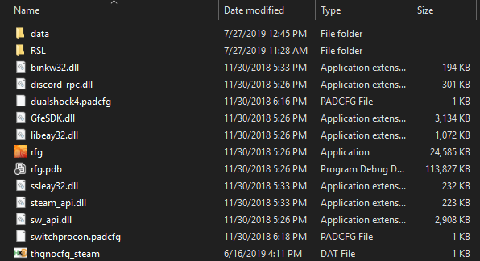

Installation
========================================================

Requirements
--------------------------------------------------------

- The `Visual Studio 2019 x86 Redistributable <https://support.microsoft.com/en-us/help/2977003/the-latest-supported-visual-c-downloads/>`_ is required for RSL. You might need to fully restart your PC for the install to properly complete.

Steps
--------------------------------------------------------

.. note:: If you have a version of RSL prior to 0.5.0 installed, you should delete it before installing this version to minimize the chance of issues.

- Download the latest release from the `releases page <https://ci.appveyor.com/project/Moneyl/rsl/history>`_. Just select the latest release, click the artifacts tab, and download the zip file listed there.
- Unzip the release and copy the folder it contains into your Red Faction Guerrilla Re-mars-tered folder. In steam you can find that by right clicking the game in your library and then clicking ``Properties > Local files > Browse local files``. Don't worry about overwriting files, the RSL **does not** modify any files included with the game. After copying the files your RFGR folder should look something like this: 

   How your RFGR folder should look after a proper install. You might see a few other folders, which is fine.

.. important:: Note that RSL.dll and the Scripts and Fonts folders are not in the same folder as rfg.exe. If they are, you've made a mistake.

- Run re-mars-tered through steam as normal, you should see the RSL launcher pop up, here you can pick whether or not to play with the RSL. Choose to play with the RSL enabled.
- Wait until you hear 3 beeps. This means that the RSL has succesfully activated. It might take 5-10 seconds before occuring, and you'll likely need to load a save first before it's fully active.
- The RSL is now ready for use. You can use F1 to toggle the overlay where you'll see a welcome menu with more shortcuts. You should read the usage guide and scripting guides for more info.

Troubleshooting
----------------------------------------------------------

- Make sure to restart your computer if you haven't already after installing the Visual Studio 2019 x86 Redistributable. There have been a few instances where the installation wasn't properly completed until the user fully restarted. For best results you should fully power down and start your PC again after several seconds.
- If that doesn't solve your issue, please `create a new github issue <https://github.com/rsl-dev/RSL/issues/new>`_ or contact us on the `Official Red Faction Discord Server <https://discord.gg/wYT7pj5>`_ in the mod_makers_talk channel. When you report a bug, please include a zipped copy of your RSL logs folder ``/RSL/Logs``, the version you are using (available in the RSL about menu, or just as the name of the zip file you downloaded), and if possible, steps for reproducing your problem and a description of what is happening.