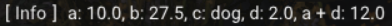
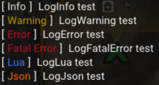

Logging
********************************

RSL provides several options for logging values via lua scripts. The simplest way to log something is to pass a string to ``rsl.Log``, like so:

.. code-block:: lua

    rsl.Log("Test log\n")

Note that you must pass your own newline character ``\n`` for each message you log unless you want the next message to be on the same line. 

Formatting
-------------------------------
It also supports formatting by passing your format string as the first argument, and the values to format as the remaining arguments. One way to do this is shown below:

.. code-block:: lua

    a = 10
    b = 27.5
    c = "dog"
    d = 2

    rsl.Log("a: {}, b: {}, c: {}, d: {}, a + d: {}\n", a, b, c, d, a + d)

   Output for the above logging example

If you wanted to have the same formatting as above without using a format string you'd have to do something like this:

.. code-block:: lua

    a = 10
    b = 27.5
    c = "dog"
    d = 2
    rsl.Log("a: " .. tostring(a) .. ", b: " .. tostring(b) .. ", c: " .. c .. ", d: " .. tostring(d) .. ", a + d: " .. tostring(a + d) .. "\n")

Which is much longer and messier (which means more chance of bugs), and likely less performant. Hopefully with these examples it's clear how formatting is extemely useful. Several different format string syntaxes are supported, such as printf style formatting or c# style formatting. See this page for more examples of fmt string syntax: https://fmt.dev/latest/syntax.html

Filtering
---------------------------
There are also logging functions which let apply different filtering tags to your log message, as shown below:

.. code-block:: lua

    rsl.LogNone("LogNone test\n") -- Has no filtering tag
    rsl.LogInfo("LogInfo test\n") -- Really the same thing as rsl.Log
    rsl.LogWarning("LogWarning test\n")
    rsl.LogError("LogError test\n")
    rsl.LogFatalError("LogFatalError test\n")
    rsl.LogLua("LogLua test\n")
    rsl.LogJson("LogJson test\n")
   

   Output for each tagged logging function.

If you look in the RSL logs folder, you'll see several files after running RSL at least once such as ``Error Log.txt``, ``Lua Log.txt``, and ``General Log.txt``. These logs contain anything you log with one of the rsl logging functions and are filtered based on which logging tags you applied to each message.